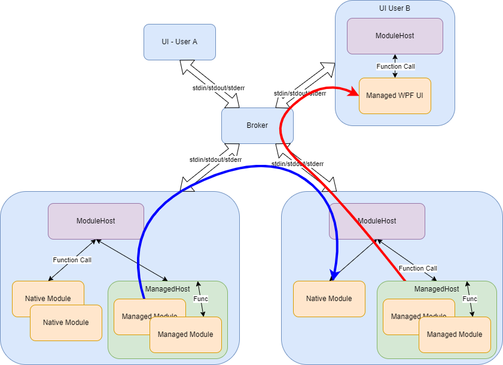
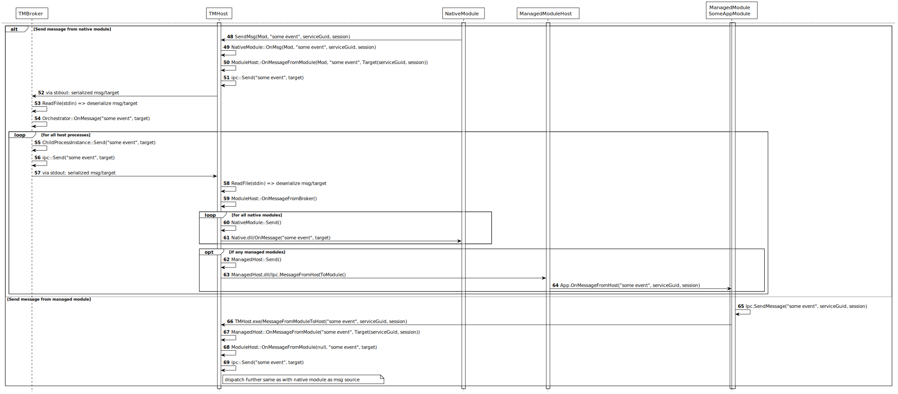

# The Modularian


* Initially it only was my playground for some custom .Net hosting experiments started at a boring new year's eve 2020/2021...
* It then was lying around until xmas vaction 2021...
* Wanted to write something like this since many year and it started to get some traction...
* Few weeks later I guess it's mostly done...
* My intend is to have finegrained control over hosting multiple native and managed modules together in a single or multiple process(es).
* There should be a bidirectional communication possible between native and managed modules, preferrably some pub/sub.
* That process may run as commandline app (for debugging only) or Windows service.
* It should be supported to run many such processes in parallel each with a different set of loaded modules. 
* Processes/modules should be configurable on demand.
* It should be secure...whatever that means...

# Overview



Currently it works like this:
* There is a single broker process (TMBroker64/32.exe) running as a Windows service. It may be run as AM-PPL when there's a respective ELAM driver.
* The broker launches one or multiple child processes (TMHost64/32.exe) each of which may host multiple native and/or managed modules (DLLs).
* Child processes may be launched automatically in all currently active sessions.
* Child processes are launched as protected processes in case the broker itself is running as PPL.
* Child processes are put into job objects (one per session) which are configured to kill child processes as soon as the broker dies.
* Such job object may be used to enforce quotas (CPU, RAM, HD usage). Could easily be a part of the broker configuration. (not yet done)
* The broker monitors all child processes and relaunches any died child process.
* There's a broker.json declaring child processes and modules to be loaded by default as well as certain properties.
* Process/Module layout can be changed on demand.
* Modules may be unloaded/reloaded to e.g. update some on demand.
* Processes communicate via stdin/stdout for publishing messages to specified topics and stderr for logging. See [IPC](#ipc) below.
* Everyone within the closed group of processs may send messages to the broker which dispatches to everyone who has subscribed to a topic.
* Managed modules are hosted in a custom host instead of the standard apphost, comhost, muxer, etc. This is mainly to have full control and tweak certain [security](#security) properties.
* Managed modules are orchestrated by a ManagedHost.dll utilizing AssemblyLoadContext's to somewhat isolate modules and allow dynamic load/unload. This uses the great [McMaster.NETCore.Plugins library](https://github.com/natemcmaster/DotNetCorePlugins).
* Managed UI modules (e.g. WPF apps) usually have assembly DLLs which are actually marked as EXE in PE header. A TMHost may only have a single such UI module which is loaded directly instead of ManagedHost.dll.
* The broker should run in native bitness, while even on 64bit OS host child processes may be configured to run 32bit.
* UI child processes may be configured to run with increased integrity level (see [Integrity Level](#integrity-level-ui)).
* There's a central ConfStore module handling a single JSON. Every module may participate by storing it own JSON object. Partial modifications are easy with JSON merge-patch.
* There's a trivial IpcMonitor module to have a peek into every IPC message in the system. Formatting messages as JSON if feasible.
* There's a ShellExec module to lauch external content like http sites in default browser. This breaks out of the job object to not also kill on close e.g. Chrome if that wasn't running at the time of message arrival.
* There's a sample module showcasting how to send arbitrary messagees, how to lauch a web site, how to read module configuration from ConfStore and how to reconfigure the entire process tree on button click.

## IPC
Processes communicate via stdin/stdout for message broadcasting and stderr for logging.
There're 2 reasons for this choice: simplicity and [security](#communication).

Communication is just sending a UTF8 string to a target topic GUID / WTS session.
Messages are always send to the broker which dispatches them to "every" module (including sender).
As an optimization processes only receive certain messages if any of his loaded modules has subscribed to a topic.
Module DLLs are responsible to handle certain topic GUID as declared during module initialization.
The broker itself as well as the host processes themselves also have topic GUIDs to e.g. perform init, module (un-)load.

Overall the messaging is a simple pub/sub. 
Subscriptions are just normal messages sent to a dedicated topic GUID and by that in no way different than any other kind of message.
In general messages are basically either events (something happened) or commands (do something).

Not having a form of explicit request/response mechanism is also intentional.
IMHO restricting stuff to pure async messaging enforces cleaner designs and thus provides much better decoupling. It also is much easier to implement. In many cases you anyhow need to handle change-events very much the same as the response to a request. E.g. when handling configurations/settings. They may be changed somehow and a change-event may be triggered. During startup you typically require some initial configuration state, so you may wanna send a get-conf-xyz request. Instead you may just send a "someone-please-send-config-for-module-xyz" message and sit and wait for some event arriving. Since you anyhow need to be prepared to handle change-events at any time it is easier to make this the only entry point for change.
I know this is controversial ;)

### Init


### Load module


### Send diagnostic output


### Send messages



## Security

### Communication

Alternatives like named pipes are easily attacked, e.g. by guessing the name and Mallory creating such pipe before our processes do. This can only be mitigated with the help of a npfs filter driver protecting certain names. Even worse in case of multiple processes attaching to the same named pipe communication can not just be blocked but also changed.

In former times anonymous pipes were implemented with normal named pipes. Today (Win7+ see [CreatePipeAnonymousPair7](https://stackoverflow.com/questions/60645/overlapped-i-o-on-anonymous-pipe)) they are named pipes w/o a name. So there's no usermode way to intercept or block anonymous pipes, at least none I may imagine ;)

Getting local socket stuff safe is IMHO almost impossible.

RPC:

COM:


### Process Mitigations
Using quite some flags with UpdateProcThreadAttribute()
* Inherit only defined handles (currently only pipe)
* ASLR: High entropy, Bottom up
* DEP:
* Control flow guard
* Somehow prevent DLL issues by e.g preferring System32, doing static linking libs whenever possible. Using delay-load otherwise so we can pre-load DLLs from correct paths.
* CETCompat doesn't seem to work together with .Net 6
* Filtering environment variables.
* Ensure child processes are launched by the broker

### Integrity Level (UI)
To prevent unelevated Mallory from controlling our UI we may run UI processes at an increased integrity level, e.g. Medium-Plus. (0x2100).
Windows messages can only be send to same or lower integrity level processes.

# Build

This repository is using [vcpkg](https://github.com/microsoft/vcpkg) for native dependencies.
To get started you somehow need to get vcpkg onto your machine and integrate with MSBuild.
This may help: https://devblogs.microsoft.com/cppblog/vcpkg-artifacts/

Just recently Microsoft has screwed up this download link: https://aka.ms/vcpkg-init.ps1
So you may need to use this instead below:
https://github.com/microsoft/vcpkg-tool/raw/main/vcpkg-init/vcpkg-init.ps1

 E.g. on a Powershell prompt:
```
> iex (iwr -useb https://aka.ms/vcpkg-init.ps1)
> vcpkg integrate install
```
This installs vcpkg into ~\.vcpkg

TODO: Need some Build.ps1

# Run

Just start the TMBroker64.exe
